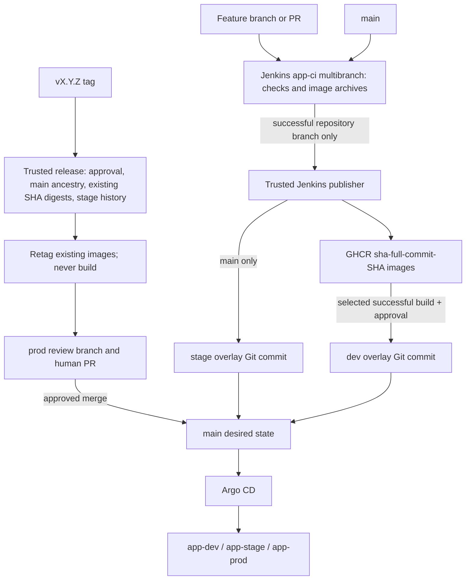

# GitHub Flow + Jenkins + GHCR + Argo CD

`main` is the only long-lived branch. Use short-lived feature branches and reviewed
pull requests. Jenkins checks/builds artifacts and writes Git; Argo CD reconciles
application resources. Jenkins has no application deployment commands or cluster
credentials. Existing Compose files remain useful for local development.



## Layout and trust boundary

| Path | Purpose |
| --- | --- |
| `Jenkinsfile` | Credential-free multibranch CI; backend mypy/Ruff/tests, JUnit/coverage, frontend TypeScript/Vite, all overlay validation/promotion safety tests, BuildKit image archives |
| `Jenkinsfile.promote` | Separate trusted standalone job loaded ONLY from protected main; successful-build verification, publishing, Git-only promotions |
| `ci/tools.sh` | Version/checksum-pinned amd64 Kustomize 5.6.0, kubeconform 0.6.7, crane 0.20.3 |
| `ci/validate.sh` | Render and strictly schema-check all overlays against Kubernetes 1.31 |
| `ci/publish.sh`, `ci/promote.py` | Registry operations and Git writer; no execution of selected source revision |
| `ci/jenkins-controller-rbac.yaml` | Bootstrap-only agent Pod management in dedicated CI namespaces |
| `deploy/base` | Shared Deployments, Services, ConfigMaps, migration Job, PVC and Ingress; no plaintext Secrets |
| `deploy/overlays/dev` | Selected development SHA/digests and dev configuration |
| `deploy/overlays/stage` | Latest eligible successful main SHA/digests and stage configuration |
| `deploy/overlays/prod` | Reviewed release SHA/digests and production configuration |
| `argocd/project.yaml` | Restricts repository, three namespaces and namespaced resource kinds |
| `argocd/applicationset.yaml` | Three applications tracking main, automatic prune/selfHeal |

The two-job split is intentional: a `when` condition in a branch-controlled
Jenkinsfile is **not** a credentials security boundary. Branch authors can edit
that file. Only the `trusted` folder holds write credentials. The publisher copies
image archives as data and never runs branch scripts or Dockerfiles. It verifies
that the exact numbered CI build finished SUCCESS and that artifact SHA matches
the Jenkins Git plugin revision. PR jobs are rejected and do not archive images.
Do not allow users to create arbitrary jobs under `app-ci` or change the trusted job.

## Jenkins setup (required before enabling webhooks)

1. Install Pipeline/Declarative, Git, GitHub Branch Source, Kubernetes,
   Credentials Binding, JUnit, Timestamper, Pipeline Utility Steps, HTTP Request,
   Copy Artifact, Pipeline Build Step, Basic Branch Build Strategies (for tags),
   Lockable Resources, and an authorization
   plugin (Role Strategy or equivalent). Use supported plugin versions and test
   the Declarative linter on your controller. Coverage XML is archived; a coverage
   visualization plugin is optional. Configure GitHub status reporting through
   Branch Source; require the actual emitted Jenkins context in GitHub rules.
2. Create namespaces `jenkins-ci` and `jenkins-publish`. Configure cloud
   `kubernetes` for CI and `trusted-kubernetes` for the publisher. Use
   `ci/jenkins-controller-rbac.yaml` as an operator-reviewed starting point.
   Agent service accounts need **no RBAC** and do not mount API tokens. Revoke
   pre-existing Jenkins workload permissions in `dev` (including the historical
   `jenkins-agent` RoleBinding); changing a file does not revoke live RBAC.
   `k8s/rbac/jenkins-dev-rbac.yaml` and the old controller-dev RBAC file now define empty legacy Roles. Remove any other broad pre-existing controller grants too.
3. Restrict the trusted cloud to the `trusted` folder using Kubernetes plugin
   cloud restrictions. Enforce admission restrictions on CI Pod creation:
   fixed CI namespace/node pool, no hostPath/host networking, no Secret mounts,
   no service-account token mounts, and no selection of privileged service
   accounts. Do not place application secrets in CI namespaces. Folder-scoped
   credentials alone do not secure a controller that can be tricked into creating
   arbitrary Pods in the publisher namespace. Test these denials explicitly.
4. BuildKit remains privileged. Run CI on dedicated disposable worker nodes
   with no production workloads or credentials; privileged build containers can
   compromise their node. For hostile public PRs use a separate isolated build
   cluster/controller or do not enable fork PR execution until this boundary
   is in place. The publisher is unprivileged and must run on separate trusted
   nodes. Configure node scheduling through restricted cloud Pod templates and
   admission policy. Network-isolate workers from application databases and
   controller administration endpoints while allowing required agent traffic.
5. Configure agent URL, e.g. `http://jenkins.jenkins.svc.cluster.local:8080`, and
   WebSocket or port 50000 connectivity. Set the controller's `JENKINS_URL` to an
   address reachable by its HTTP Request plugin. Both clouds require amd64 nodes.
   Python and Node containers have limits; BuildKit is limited to 2 CPU/2 GiB;
   isolated PostgreSQL 16 is loopback-only, without a Service, host port or PVC.
   Allow additional resources for the inbound agent and large image archives.
6. Create multibranch job **`app-ci`** using GitHub Branch Source and script path
   `Jenkinsfile`. Discover repository branches, PRs (untrusted fork strategy),
   and tags. Enable the tag build strategy; tag discovery alone may not build
   tags. Use full checkout history, no shallow clone. Configure the GitHub webhook
   for push/PR/tag events and periodic indexing as a fallback. Checkout/scan
   credentials must be read-only; never global registry/Git write credentials.
7. Create folder **`trusted`** and standalone Pipeline **`trusted/publish`**,
   Pipeline from SCM, branch `*/main`, script `Jenkinsfile.promote`, full clone.
   Restrict Configure/Replay/credential administration to CI administrators.
   It must never load its Jenkinsfile or helper scripts from a parameter, PR or
   release tag. Restrict Build permissions to the CI execution identity and
   operators. The CI job schedules this job asynchronously after success; the
   publisher waits for CI completion and fails unless its result is SUCCESS.
   Monitor the publisher job separately: a successful CI status does not prove
   publication or promotion succeeded. Retry with the original job/build number.
8. Give the publisher Copy Artifact read access to `app-ci/*` through plugin
   permissions and Jenkins Job/Read + Job/Discover + artifact access. Configure
   authorization so build parameters cannot select jobs outside `app-ci`.
   PR names must retain the GitHub Branch Source `PR-<number>` convention.
9. Create the credentials below **inside `trusted` only**. Configure Jenkins group
   `release-managers` for the input gate (or replace the submitter with your exact
   approved user/group IDs). Configure lock resource `fastapi-ghcr-gitops`; all
   publishers must share this resource and controller. No separate script may
   write these image tags or promote these overlays concurrently.

### Credentials and external secrets

| ID/location | Type and exact purpose |
| --- | --- |
| `ghcr-write` in trusted | Username/password: GitHub machine account + PAT classic with `write:packages` (includes package read), authorized for the organization/SSO and both GHCR packages. No delete/admin permission. Avoid repository scope if your account setup permits; associate packages with the repository. |
| `gitops-write` in trusted | Username/password: separate GitHub account/token, fine-grained token restricted to this repository, Contents read/write (and implicit Metadata read). Writes stage/dev commits and `release/*` branches; does not merge prod. No Actions, administration or package permissions. |
| `ci-read` in trusted | Username/password: Jenkins service user/API token; Overall/Read, Job/Read/Discover on app-ci and artifact read only. HTTP Request uses it to verify build status/revision. No Build/Configure/admin permission is needed for this user. |
| SCM discovery/checkout | Separate read-only GitHub credential; private repository contents read and discovery metadata. GitHub status reporting needs Commit statuses write or appropriate GitHub App Checks permission; do not reuse GitOps credentials. |
| Optional future PR automation | Separate GitHub App installation/fine-grained token: this repository Pull requests read/write and Contents read. No credential is used by current code for PR creation; open the printed compare link manually. |
| Argo repository access | Read-only deploy key or GitHub App credential in Argo CD if the repository is private. |
| `ghcr-pull-secret`, each app namespace | Kubernetes dockerconfigjson with a distinct package-reader credential (`read:packages`), no push permission. |
| `backend-secrets`, each app namespace | `SECRET_KEY`, `FIRST_SUPERUSER_PASSWORD`, `POSTGRES_PASSWORD`, optional `SMTP_PASSWORD`; unique strong values per environment. |
| `db-secrets`, each app namespace | `POSTGRES_PASSWORD`, matching that environment's backend secret. |
| `app-tls`, each app namespace | TLS certificate/key for the actual ingress hostname, issued by your certificate management system. |

The old `ghcr-creds` mounted Kubernetes Secret is not used by either pipeline.
Only its manifest reference was inspected; no live Secret was read. Provision
Jenkins credentials from your secret manager. Never paste real values into Git,
job parameters, shell tracing, or documentation. Out-of-band app Secrets are
intentionally outside Argo's managed/pruned resource set. The old sealed secrets
are namespace/cluster-specific and cannot be reused in `app-*` unchanged.

## Environments and immutable artifacts

- **Feature branches:** run all checks, build both image archives, publish through
  the trusted job to `sha-<40-character-SHA>`. No deployment by default. PR builds
  run checks/build validation with no publishing or write credentials.
- **Dev:** run `trusted/publish`, `MODE=dev`, exact `CI_JOB` and `CI_BUILD` from a
  successful repository-branch build. An authorized release manager approves.
  Existing images are reused; missing images are copied from retained checked
  archives. Git changes only; Argo deploys. Retain archives until published.
- **Stage:** a successful application-changing main build automatically publishes
  and writes its exact SHA/digests to stage. A superseded build cannot roll stage
  back. Argo deploys the Git change. Failed publish/promotion can be retried with
  the same numbered CI build; no image rebuild is needed.
- **Prod:** discovered version tags schedule release mode; alternatively run
  `trusted/publish` with `MODE=release`, `RELEASE_TAG=vX.Y.Z`. An authorized input
  gate confirms that the digest pair actually ran successfully in stage. Jenkins
  verifies main ancestry, both SHA images and matching stage Git history, retags
  the existing digests, and pushes only `release/vX.Y.Z`. Open the printed compare
  link as a PR, obtain review, then merge. Argo automatically syncs after merge.

SHA tags are write-once **by publisher policy**, not a registry immutability
feature. Existing tags are never overwritten, even on a repeated CI build. Both
images are built before either is published. A partially completed upload is
retryable; no environment changes until both images resolve. Kubernetes overlays
record SHA tags **and digests**; Kustomize renders the digest as the authoritative
image reference. Release tags may exist before the production PR is approved;
creating a registry tag does not deploy it. Restrict GHCR writers and retention
so deployed digests cannot be deleted. Digests prevent tag movement changing Pods.

Frontend images use an empty `VITE_API_URL`, so browser requests use the current
origin. Ingress routes `/api` to FastAPI and `/` to nginx. Build-time hostnames
must not vary by environment. Local Compose can still supply its API build arg.
Backend probes use the existing `/api/v1/utils/health-check/`; it is a process
health check, not a database readiness check. PostgreSQL has a readiness check.
Argo sync waves create config/storage/database at -2, run the migration Sync hook
at 0, and roll out backend/frontend at 1. A Sync hook allows first installation
with database resources in earlier waves; a PreSync hook would run too soon.
Migration failures block rollout. Use backwards-compatible migrations: old Pods
remain serving during migrations. The retained single-instance PostgreSQL design
is not HA; arrange backups/restore and appropriate storage before production.
Adminer is preserved as an internal Service, without public ingress.

### Recursion and concurrency

CI inspects the actual changed paths, not just `[skip ci]` text or author identity.
Commits changing only `deploy/`, `argocd/` or Markdown render/validate overlays but
skip application tests/build/archive/publication. This includes generated
promotion commits and reviewed production overlay changes. Mixed source changes
still build. Version tags never rebuild. Such GitOps/docs-only commits have no
SHA image; release the recorded stage application SHA, not the subsequent bot SHA.

Both jobs disable concurrent builds per job. The publisher also takes a global
lock for all registry and Git writes. Stage checks source freshness and monotonic
Git ancestry, so a delayed older build cannot overwrite a newer promotion.
Git writes use normal fast-forward pushes (no force) and retry after fetching
and regenerating only the selected overlay, so unrelated concurrent main changes
are preserved. Dev selection is explicit and serialized. Production uses a
version-specific branch and GitHub review; require an up-to-date branch before
merging, and reject obsolete release PRs. Historical promotion records remain in
Git; `promotion.json` records SHA, digest pair and optional release version.

## Release procedure

Tag the actual built application commit recorded by stage. A plain tag of main's
latest bot commit intentionally fails because that commit has no built images.

```bash
git checkout main
git pull --ff-only
release_sha=$(python3 -c 'import json; print(json.load(open("deploy/overlays/stage/promotion.json"))["sha"])')
git tag v1.2.0 "$release_sha"
git push origin v1.2.0
```

Tag discovery schedules the trusted release process; approve its Jenkins input
only after checking Argo `app-stage` is Healthy/Synced at the recorded digest pair
and running the appropriate smoke tests. Jenkins deliberately has no Argo/cluster
access and cannot verify runtime health itself. If discovery is unavailable,
start release mode manually. Missing images or absent stage history fail closed.
Jenkins opens no PR itself: follow its printed GitHub comparison link, create the
PR and review the exact production digest/config diff. Do not merge an older
release PR after a newer release. No image rebuild occurs during this procedure.

## GitHub rules required

Protect main: require PR review, code-owner review, dismiss stale approvals,
require approval of the last push, require the Jenkins CI status and up-to-date
branches; prohibit force push and deletion. Add your real infrastructure/release
team to CODEOWNERS for `Jenkinsfile*`, `ci/`, `deploy/`, `argocd/`, Dockerfiles,
`.github/`, and especially all production-affecting shared base resources. No
placeholder CODEOWNERS is supplied because the actual authorized team is unknown.
Changes to the shared base affect prod immediately after merge and require the
same production review as the prod overlay. Limit ruleset bypass to the dedicated
GitOps machine account needed for automatic stage/dev commits; no human/developer
bypass. That account's trusted code writes only the intended overlay. GitHub does
not provide a path-scoped Contents-write token: compromise of this bypass account
can change prod or pipeline code. If this residual risk is unacceptable, use a
separate stage/dev GitOps repository or an independently enforcing GitHub App
before enabling automatic direct commits. Restrict token access and audit usage.

Protect `v*` tags with rulesets: only release managers may create them; forbid
updates/deletion. Allow the GitOps writer to create short-lived `release/*`
branches, but never auto-merge them. Configure webhooks and required status names
from an observed Jenkins run. Old GitHub Actions deployment workflows are renamed
`.yml.disabled`; other template maintenance/test workflows remain supplemental,
not the deployment authority. Review their secrets separately, especially the
legacy generated-client workflow's write token. Jenkins remains required CI.

## Argo CD bootstrap and rollback

See [deployment.md](deployment.md) for operator-only bootstrap, prerequisites,
rollbacks and legacy-manifest migration. No bootstrap command is run by Jenkins.

## Verification and operating limits

Local results are recorded in [ci/VERIFICATION.md](ci/VERIFICATION.md). Before live
use, validate both pipelines with your controller's Declarative linter, then run
a non-production acceptance exercise covering: PR credential denial, feature
publish, repeated SHA publication, main promotion, GitOps recursion, overlapping
main builds, missing-image release failure, release approval and prod PR review.
Use a registry read/write sandbox for this exercise. Monitor both CI and publisher
jobs plus Argo application health. Jenkins build retention is 30 CI builds/10
archive sets and 100 publisher builds; configure adequate artifact storage.

Tools are downloaded from fixed upstream releases with fixed archive SHA256s;
kubeconform also needs access to its upstream Kubernetes schema repository. For
fully offline validation, mirror schemas/tools internally and pin that mirror.
Base/agent images use explicit versions but are not digest pinned, and their age
is not a security-support guarantee; maintain reviewed updates and scan images.
No image signing or vulnerability gate has been added in this change.
